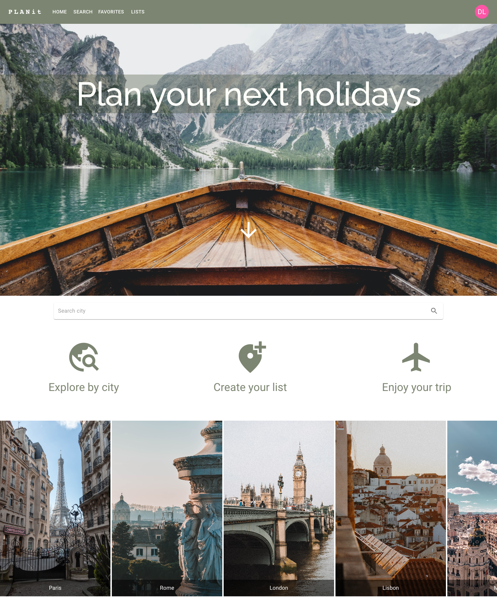
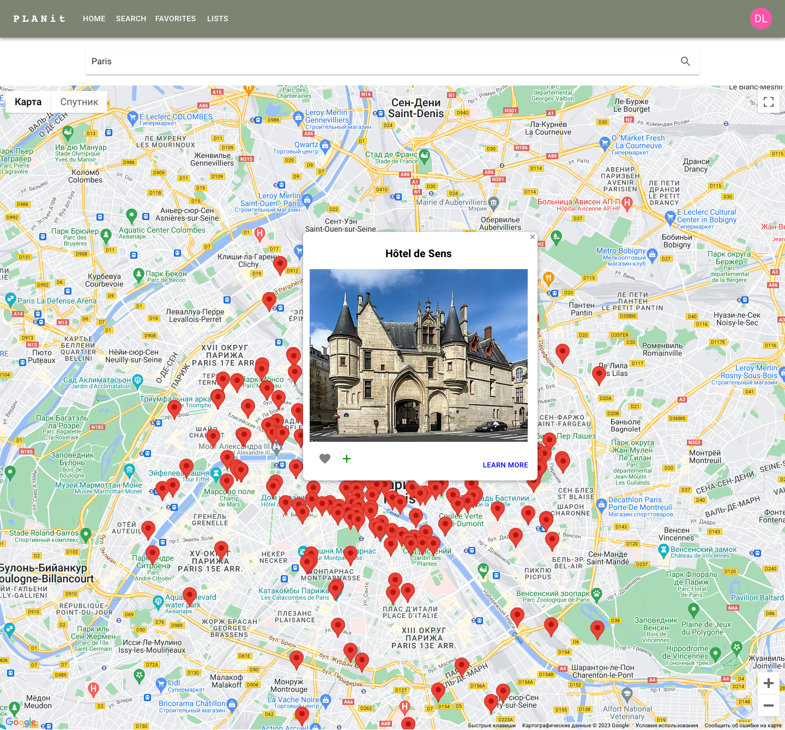

# holiday-planner
Project is about creating list with tourist attractons and plannig your future trip.

Technologies used:
- MERN
- Material UI 

4 external APIs: 
- Pixabay
- OpenTrip
- GoogleMaps
- GoogleAuth

